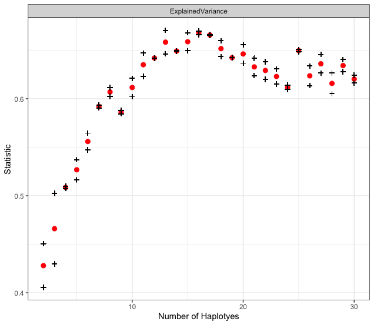
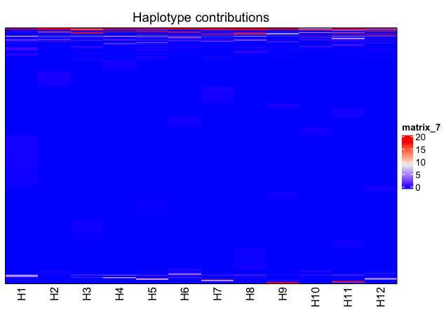
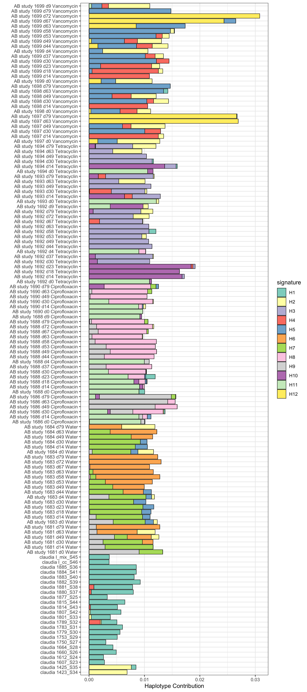
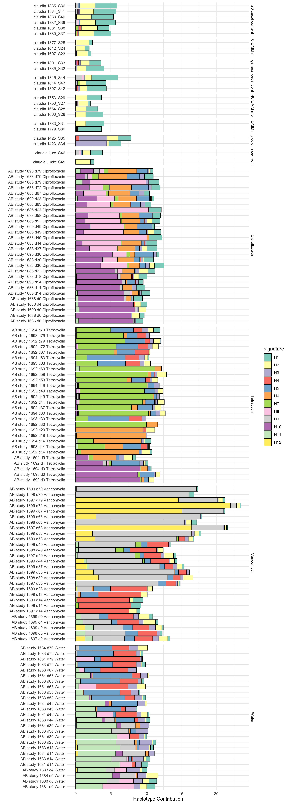
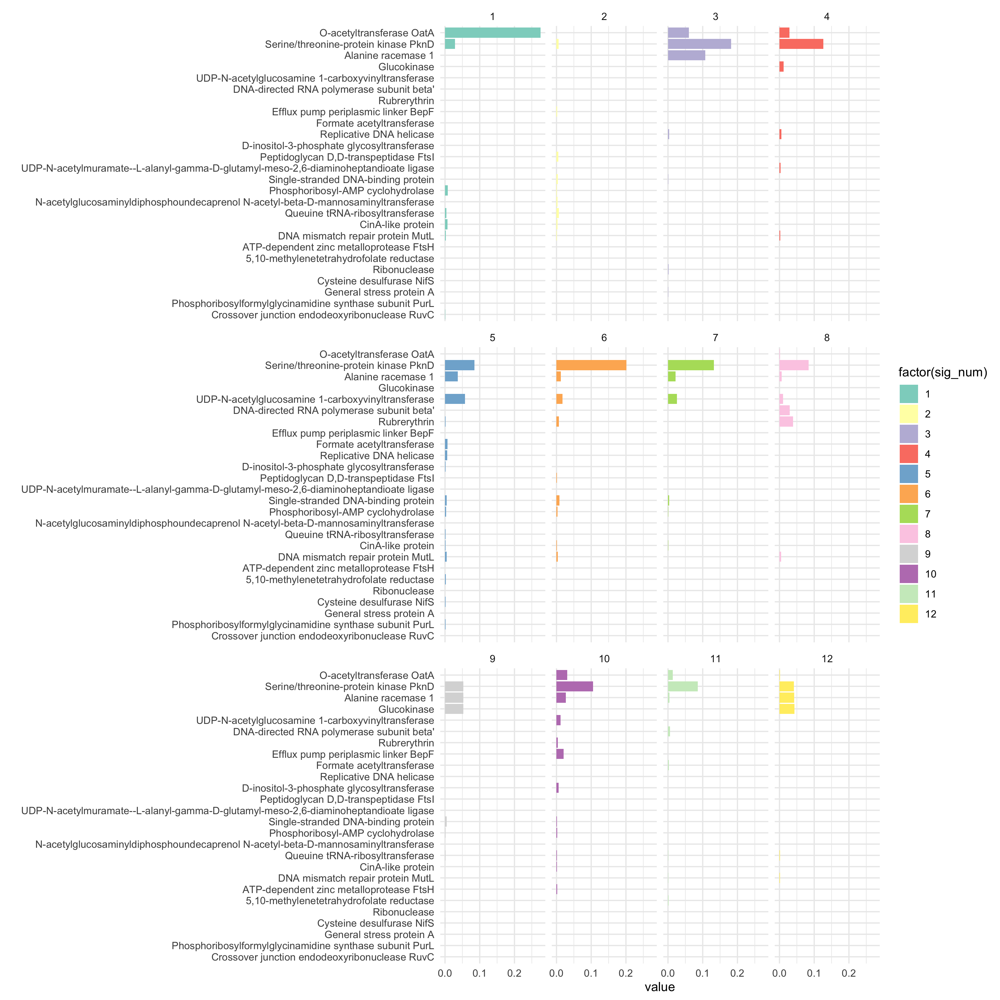

# Haplotype reconstruction using non-negative matrix factorization 

Detects linear combinations of SNPs (signatures) using NMF that explain a global SNP profile. This library is heavily based on the [SomaticSignatures](https://github.com/juliangehring/SomaticSignatures) package.

## Installation

```r
devtools::install_github("philippmuench/HaplotypeDeconstructor")
```

## How it works

Input to the haplotype deconstruction is the SNP profile (in terms of allele frequency per SNP) of multiple observations (i.e. independent studies on the same community) such as `data(omm)`

```r
library(HaplotypeDeconstructor)
data(omm2)
dim(omm2)
[1] 1691   134
```

Here, we have 134 studies of which we have 1691 SNPs in total for the genome _Akkermansia muciniphila_. In general, the user needs to specify the number of haplotypes to deconstruct for. Since this is unkown, the function `assessNumberHaplotyes` tries out different values and returns the explained variance per test. E.g. 

```r
# check how many haplotypes are in the community
gof <- assessNumberHaplotyes(omm2, 2:30, nReplicates = 2)
plotNumberHaplotyes(gof)
ggsave("gof.png", width = 8, height = 5)
```

Will evaluate 2 to 30 haplotypes and output a graphic similar to this:



Based on this figure it seems that there are around 29 (?) haplotypes present, so we do the final decomposition. But for now we use a lower number since its hard to draw figures with 29 colors

```r
decomposed <- findHaplotypes(omm2, 12)
plotHaplotypeMap(decomposed)
```



The result is a heatmap showing the SNPs (y axis) and the Haplotypes (i.e. the decomposed "signatures") on the x axis. Here we see that most SNPs are not part of a haplotype. 

```r
plotSamples(decomposed, normalize = F, percent = T)
ggsave("sampleplot.png", width = 8, height = 18)
```



Now we can better organize the by additional metadata groups

```r
data(omm2_metadata)
plotSamplesByGroup(decomposed, omm2_metadata, normalize = F, percent = T)
ggsave("bygroup.png", width = 9, height = 25)
```



We can visualize the SNP annotations for each Haplotype

```r
data(omm_snp_annotation)
plotHaplotypeAnnotation(decomposed, omm_snp_annotation, sig_threshold = 4)
ggsave("haplotypefunction.png", width = 12, height = 12)
```


