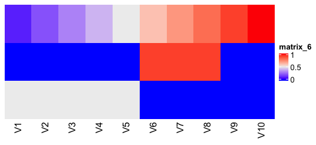
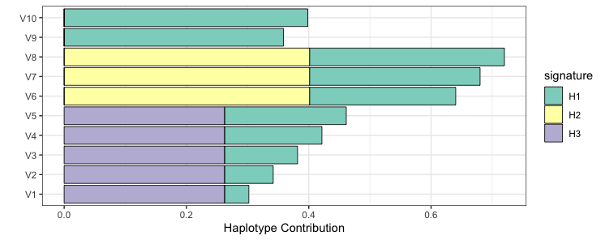

# Haplotype reconstruction using non-negative matrix factorization 

Detects linear combinations of SNPs (signatures) using NMF that explain a global SNP profile. This library is heavily based on the [SomaticSignatures](https://github.com/juliangehring/SomaticSignatures) package and uses the "Sparse non-negative matrix factorizations via alternating non-negativity-constrained least squares" implementation from [Kim et al.](https://academic.oup.com/bioinformatics/article/23/12/1495/225472)


## How it works

Input to the haplotype deconstruction is the SNP profile (in terms of allele frequency per SNP) of multiple observations (i.e. independent studies on the same community) such as `data(omm)`. Using NMF, this matrix will be decomposed where one component can be seen as Haplotpyes (linear combinations of SNP observed in multiple samples).

## Installation

To 
```r
devtools::install_github("philippmuench/HaplotypeDeconstructor")
```

## Usage

```r
library(HaplotypeDeconstructor)
```

The input is a 2D matrix where the samples (observations) of the community are the columns and individual SNPs are on the rows. The content of the matrix is the allele frequency of the SNP at the sample. A example of such input matrix is available at `data(omm)`, here the matrix only shows SNPs of a single species.

## Method evaluation

We generated a synthetic SNP profile (see `data-raw/syn.R` and `data(syn)`) which consits of 10 samples (at 10 time points) containingthree haplotypes of which one haplotype is increasing in its frequency over time.


```r
data(syn)
ComplexHeatmap::Heatmap(syn, show_row_dend = F, cluster_columns = F)
````



In detail, the syntethic datasets consists of sets of SNPs that 

- increase in their AF over time (from AF=0 to AF=1)
- are only present in a subset of samples (V6 - V8) with a high AF
- are only present in a subset of samples (V1 - V5) with a low AF


We evaluate the number of Haplotpyes present in this dataset using `assessNumberHaplotyes`

```r
gof <- assessNumberHaplotyes(syn, 2:6, nReplicates = 1)
plotNumberHaplotyes(gof)
```


We see that the larged fraction of explained variance is reached for 3 haplotpyes, which is equal to the ground truth. We can use this number to recover the haplotypes using `findHaplotypes`

```r
decomposed <- findHaplotypes(syn, 3)
plotHaplotypeMap(decomposed)
plotSamples(decomposed, normalize = F, percent = T)
```


Which correctly identifies that a haplotype (here H3) is present in samples V1 - V5 in equal proportions, a second haplotype H2 is present on samples V6-V8 and a third haplotpye H1 is present on all samples and is increasing in its contribution.


## Haplotype detection on real data

Here we show how HaplotypeDeconstructor can be applied on a SNP profile we get after applying LoFreq on a collection of samples we took from the OligoMM community on different mouse and on different time points. 

```r
library(HaplotypeDeconstructor)
data(omm)
dim(omm)
[1] 1691   134
```

Here, we have 134 studies of which we have 1691 SNPs in total for the genome _Akkermansia muciniphila_. In general, the user needs to specify the number of haplotypes to deconstruct for. Since this is unkown, the function `assessNumberHaplotyes` tries out different values and returns the explained variance per test. E.g. 

```r
# check how many haplotypes are in the community
gof <- assessNumberHaplotyes(omm, 2:15, nReplicates = 1) # this can take a while since it will evaluate many NMFs
plotNumberHaplotyes(gof)
ggsave("gof2.png", width = 8, height = 5)
```

Will evaluate 2 to 30 haplotypes and output a graphic similar to this:


Based on this figure it seems that there are around 14 haplotypes present, so we do the final decomposition.

```r
decomposed <- findHaplotypes(omm, 14)
plotHaplotypeMap(decomposed)
```

On this plot once can see which SNPs are contributing to a Haplotype, 


The result is a heatmap showing the SNPs (y axis) and the Haplotypes (i.e. the decomposed "signatures") on the x axis. Here we see that most SNPs are not part of a haplotype. 

```r
plotSamples(decomposed, normalize = F, remove.sample.names =T)
ggsave("decomposed_1.png", width = 8, height = 10)
```


and the normalized version

```r
plotSamples(decomposed, normalize = T, remove.sample.names =T)
ggsave("decomposed_2.png", width = 8, height = 10)
```


Now we can better organize the by additional metadata groups

```r
data(omm_metadata)
plotSamplesByGroup(decomposed, omm_metadata, normalize = F, percent = T)
ggsave("bygroup.png", width = 9, height = 25)
```


We can visualize the SNP annotations for each Haplotype

```r
data(omm_snp_annotation)
plotHaplotypeAnnotation(decomposed, omm_snp_annotation, sig_threshold = 0.1)
ggsave("haplotypefunction.png", width = 12, height = 12)
```


```r
library(gaston)

res <- cor(omm)
res[res < 0] <- 0

p <- LD.plot(res)

```


```r
library(gaston)

res <- cor(t(omm))
res[res < 0] <- 0

p <- LD.plot(res, 
max.dist = 1e6,polygon.par = list(border = NA), write.ld = NULL)

```

