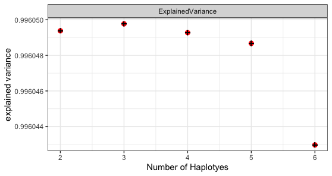

# Haplotype reconstruction using non-negative matrix factorization 

Detects linear combinations of SNPs (signatures) using NMF that explain a global SNP profile. This library is heavily based on the MutationalSignatures package.

## Installation

```r
devtools::install_github("philippmuench/HaplotypeDeconstructor")
```

## How it works

Input to the haplotype deconstruction is the SNP profile (in terms of allele frequency per SNP) of multiple observations (i.e. independent studies on the same community) such as `data(omm)`

```r
library(HaplotypeDeconstructor)
data(omm)
dim(omm)
[1] 1431   39
```

Here, we have 39 studies of which we have 1431 SNPs in total for the genome _Enterococcus faecalis_. In general, the user needs to specify the number of haplotypes to deconstruct for. Since this is unkown, the function `assessNumberHaplotyes` tries out different values and returns the explained variance per test. E.g. 

```r
# check how many haplotypes are in the community
gof <- assessNumberHaplotyes(omm, 2:30, nReplicates = 2)
plotNumberHaplotyes(gof)
```

Will evaluate 2 to 30 haplotypes and output a graphic similar to this:



Based on this figure it seems that there are around 12 haplotypes present, so we do the final decomposition

```r
decomposed <- findHaplotypes(omm, 12)
plotHaplotypeMap(decomposed)
```


The result is a heatmap showing the SNPs (y axis) and the Haplotypes (i.e. the decomposed "signatures") on the x axis. 

